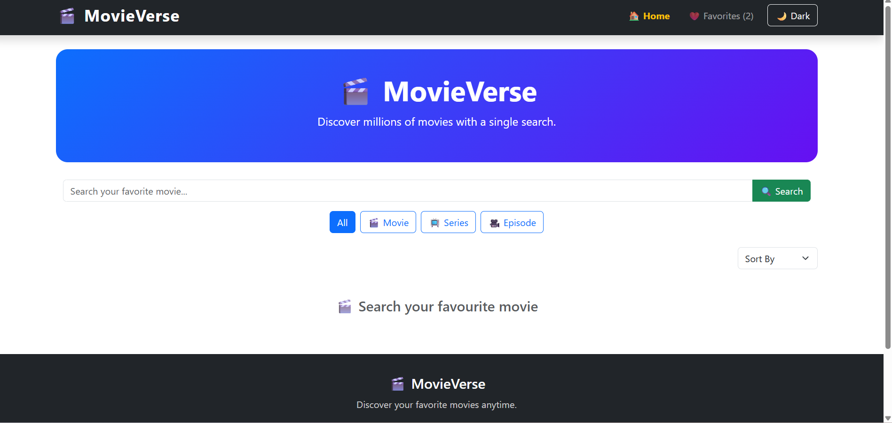
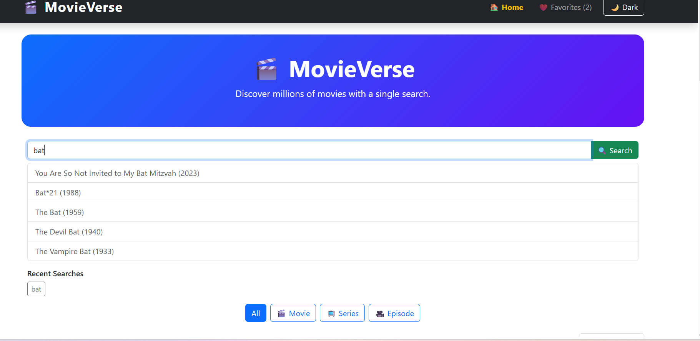
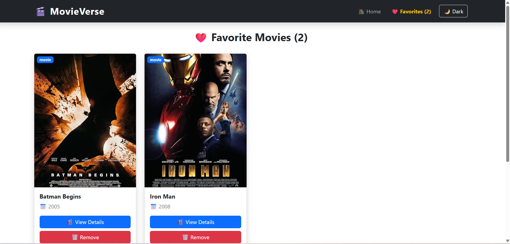
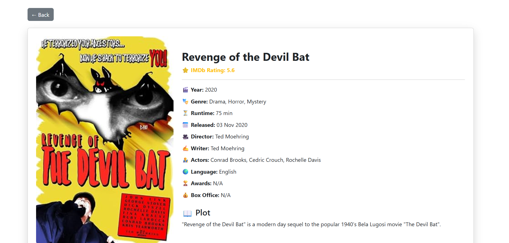
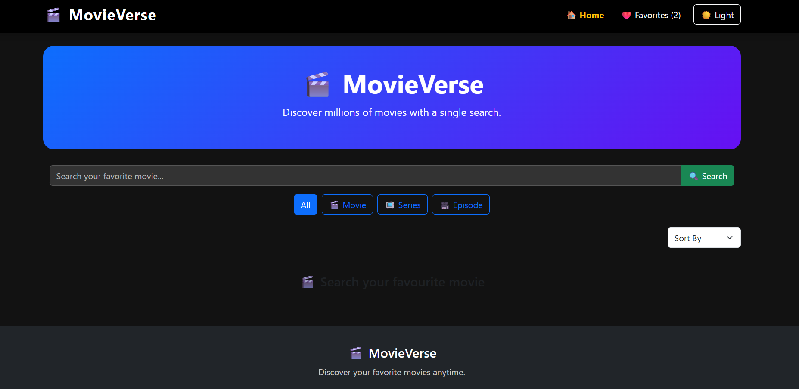

# 🎬 MovieVerse

A modern, responsive Movie Search Application built with **React + Vite** that allows users to search movies, explore detailed information, manage favorite movies, and enjoy a seamless user experience with Dark Mode.

🔗 **Live Demo:** https://movie-verse-woad-one.vercel.app

---

# 📸 Preview

# 📸 Application Screenshots

## 🏠 Home Page

The Home page provides a clean and responsive interface where users can search for movies using the OMDb API. It also includes search history, movie type filters, and pagination for better navigation.



---

## 🔍 Search Results

Users can search for any movie title and instantly view matching results with movie posters, release year, and type (Movie, Series, or Episode).



---

## 🎬 Movie Details

The Movie Details page displays complete information about the selected movie, including poster, plot, genre, runtime, release date, director, actors, language, IMDb rating, and awards.



---

## ❤️ Favorites

The Favorites page allows users to save their favorite movies using Local Storage. Favorites remain available even after refreshing the browser.



---

## 🌙 Dark Mode

Dark Mode enhances the user experience by providing a comfortable viewing interface in low-light environments. The selected theme is stored in Local Storage and persists across sessions.




---

# ✨ Features

- 🔍 Search movies using OMDb API
- 🎬 View complete movie details
- ❤️ Add / Remove favorite movies
- 🌙 Dark Mode support
- 📱 Fully Responsive Design
- 📄 Pagination
- 🕘 Search History
- 🔔 Toast Notifications
- ⬆️ Scroll To Top Button
- ⚡ Fast API Integration
- 💾 Local Storage support
- 🎨 Clean and Modern UI

---

# 🛠 Tech Stack

### Frontend

- React 19
- Vite
- React Router DOM
- Bootstrap 5
- Bootstrap Icons

### State Management

- Context API
- React Hooks
  - useState
  - useEffect
  - useContext

### Storage

- LocalStorage

### API

- OMDb API

### Deployment

- GitHub
- Vercel

---

# 📂 Project Structure

```
movie-verse
│
├── public
│
├── src
│   ├── components
│   ├── context
│   ├── hooks
│   ├── pages
│   ├── services
│   ├── styles
│   ├── App.jsx
│   └── main.jsx
│
├── package.json
├── vite.config.js
└── README.md
```

---

# 🚀 Getting Started

## Clone Repository

```bash
git clone https://github.com/dimpaldhake/movie-verse.git
```

## Navigate

```bash
cd movie-verse
```

## Install Dependencies

```bash
npm install
```

## Create Environment Variable

Create a `.env` file.

```env
VITE_OMDB_API_KEY=YOUR_API_KEY
```

## Start Development Server

```bash
npm run dev
```

## Build Project

```bash
npm run build
```

---

# 🌐 Deployment

The project is deployed on **Vercel**.

Live Website:

https://movie-verse-woad-one.vercel.app

---

# 📦 Main Components

- Navbar
- Footer
- SearchBar
- MovieCard
- Pagination
- Loader
- Toast
- ThemeToggle
- ScrollToTopButton

---

# 📑 Pages

- Home
- Favorites
- Movie Details
- Not Found

---

# 🧠 React Concepts Used

- Functional Components
- React Hooks
- Context API
- Custom Hooks
- Routing
- Conditional Rendering
- Component Reusability
- State Management
- Local Storage
- API Fetching
- Responsive UI Design

---

# 📈 Future Improvements

- Movie Trailer Integration
- Actor Details
- Similar Movies
- Advanced Filters
- Infinite Scrolling
- Watchlist
- User Authentication

---

# 👩‍💻 Author

**Dimpal Dhake**

GitHub:
https://github.com/dimpaldhake


---

# ⭐ Support

If you like this project, consider giving it a ⭐ on GitHub.

It motivates me to build more awesome projects.

---

# 📄 License

This project is developed for educational and portfolio purposes.